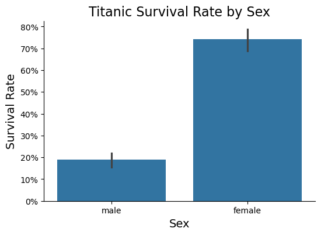
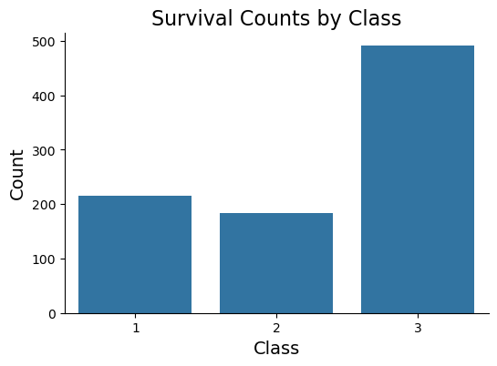
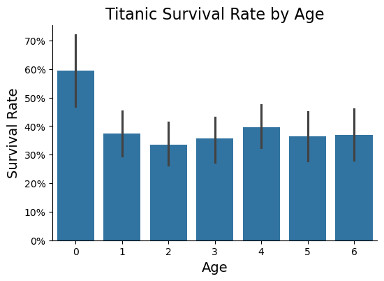

# Titanic Dataset Analysis & Survival Prediction

## Overview
This project explores the famous **Titanic dataset**, which contains information about passengers on the Titanic, including demographics, ticket class, and survival status. Our goal is to analyze the data and build predictive models to estimate the likelihood of survival based on various features. The analysis includes data preprocessing, exploratory data analysis (EDA), and model evaluation to find the best-performing classifier.

## Dataset
The dataset is sourced from the **Kaggle Titanic competition** and contains:
- **train.csv**: Used for training machine learning models. Includes both feature variables and the target variable (Survived).
- **test.csv**: Used for generating survival predictions. Does not contain the target variable.

## Dependencies
To run this notebook, install the following Python libraries:
```bash
pip install numpy pandas matplotlib seaborn scikit-learn
```

## Exploratory Data Analysis (EDA)
EDA helps uncover patterns and relationships within the dataset. Below are some key visualizations that provide insights into the data:

### 1. Suriving Passenger Gender Distribution
- This plot shows the proportion of male and female surviving passengers on the Titanic.
- Since survival rates differed significantly based on gender, this is a crucial factor for prediction.



### 2. Survival Rate by Class
- This visualization highlights how survival rates varied across different passenger classes (1st, 2nd, and 3rd class).
- Generally, passengers in **1st class had a higher survival rate**, while **3rd class passengers had the lowest survival rate**.



### 3. Age Distribution of Passengers
- This histogram illustrates the distribution of passenger ages.
- Young children had a **higher chance of survival**, while middle-aged adults had a lower survival rate.



| Age Group | Age Range         |
|-----------|------------------|
| 0         | Age <= 10        |
| 1         | 10 < Age <= 20   |
| 2         | 20 < Age <= 25   |
| 3         | 25 < Age <= 30   |
| 4         | 30 < Age <= 37   |
| 5         | 37 < Age <= 45   |
| 6         | Age > 45         |

## Machine Learning Models
To predict survival, we implemented and compared various machine learning models:
- **Logistic Regression**: A simple yet effective baseline model for binary classification.
- **Support Vector Machines (SVM)**: A more complex model that finds the optimal decision boundary.
- **Random Forest Classifier**: An ensemble learning method that improves predictive performance.
- **K-Nearest Neighbors (KNN)**: A distance-based approach that classifies based on neighbors.
- **Naive Bayes**: A probabilistic classifier based on Bayes' theorem.
- **Decision Tree**: A model that splits data based on feature conditions.
- **Stochastic Gradient Descent (SGD)**: A linear model optimized using gradient descent.

## Model Performance
Each model was evaluated using:
- **Accuracy**: Measures overall correct predictions.
- **Precision, Recall, and F1-score**: Evaluate performance on positive and negative classes.
- **Confusion Matrix**: Provides a breakdown of true positives, false positives, true negatives, and false negatives.

### Best Performing Model
After testing various classifiers, we found that **SVM** performed the best with **82.90% Acc. and 82.46% Cross-Validation Score Mean**. Future improvements could involve feature engineering and hyperparameter tuning to enhance performance.

## How to Run
1. Clone the repository:
   ```bash
   git clone https://github.com/JayGupta2003/titanic-survival-prediction.git
   cd titanic-analysis
   ```
2. Run the Jupyter Notebook:
   ```bash
   jupyter notebook titanic.ipynb
   ```

## Contributing
If you have suggestions for improvements or additional analyses, feel free to fork this repository and submit pull requests!

## License
This project is licensed under the MIT License.

